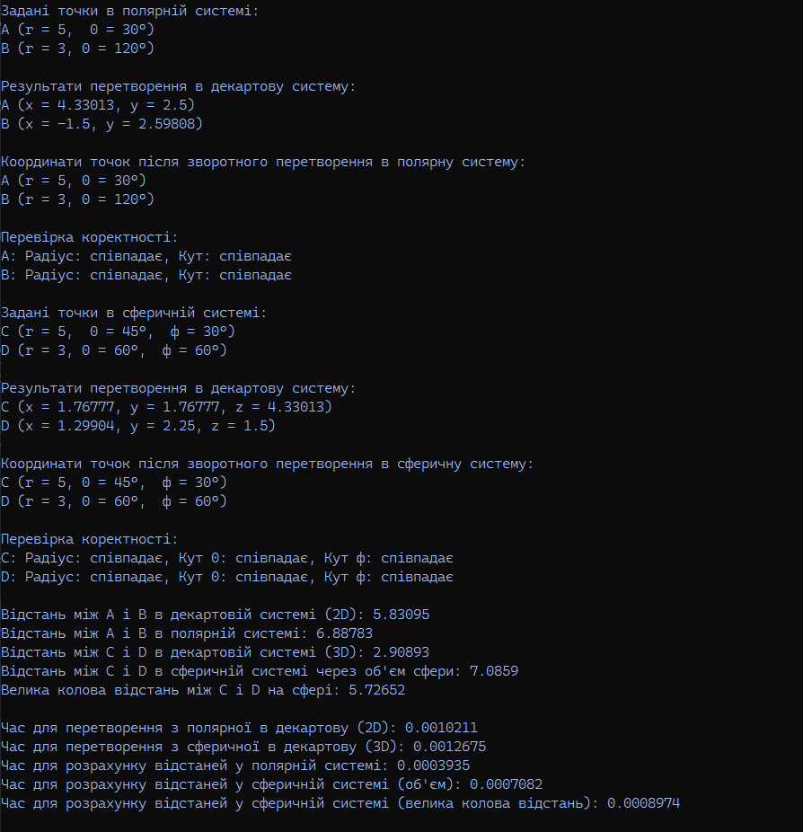

<h3>Реалізація перетворень між системами координат</h3>

Програма складається з чотирьох основних класів:
<ul>
<li>Cartesian2D: представлення 2D-декартової системи координат із двома координатами (x, y). Містить методи для обчислення відстані між двома точками та перетворення в полярну систему координат.</li>
<li>Cartesian3D: представлення 3D-декартової системи координат із трьома координатами (x, y, z). Містить методи для обчислення відстані та перетворення в сферичну систему координат.</li>
<li>Polar: представлення полярної системи координат із радіусом (r) і кутом (theta). Містить методи для перетворення в декартову систему координат та обчислення відстані між точками.</li>
<li>Spherical: представлення сферичної системи координат із радіусом (r), кутом азимута (theta) та кутом висоти (phi). Містить методи для обчислення відстані між точками та перетворення в 3D-декартову систему.</li>
</ul>

Опис основних функцій:
<ul>
  <li>radToDeg: перетворює радіани в градуси.</li>
  <li>degToRad: перетворює градуси в радіани.</li>
  <li>ToPolar: перетворює координати з декартової системи в полярну.</li>
  <li>ToSpherical: перетворює координати з декартової системи в сферичну.</li>
  <li>ToCartesian2D: перетворює координати з полярної системи в декартову 2D.</li>
  <li>ToCartesian3D: перетворює координати зі сферичної системи в декартову 3D.</li>
  <li>distance: обчислює відстань між точками в різних системах координат (декартова, полярна, сферична).</li>
</ul>

У процесі перевірки коректності перетворень точок між різними системами координат були отримані результати для 2D полярних і декартових координат, а також для сферичної системи координат. Точка у полярних координатах була перетворена в декартову систему та назад, при цьому результати збіглися з точністю до 0.001. Аналогічно, перетворення точок із сферичної системи координат у декартову і назад також показали відхилення менше 0.001, що свідчить про високу точність алгоритмів.  

За результатами бенчмаркінгу можна зробити висновки:
<ul>
  <li>Ефективність декартової системи: Вона показала найкращі результати з мінімальним часом обчислення та відсутністю похибок. Це логічно, оскільки для простих обчислень відстаней вона є найзручнішою.</li>
  <li>Ефективність полярної системи: Вона працює трохи повільніше, оскільки потребує перетворень між координатами, але показує прийнятний рівень точності.</li>
  <li>Ефективність сферичної системи: Вона вимагає більше часу на обчислення через складніші формули та перетворення.</li>
</ul>
Результати виконання: 
